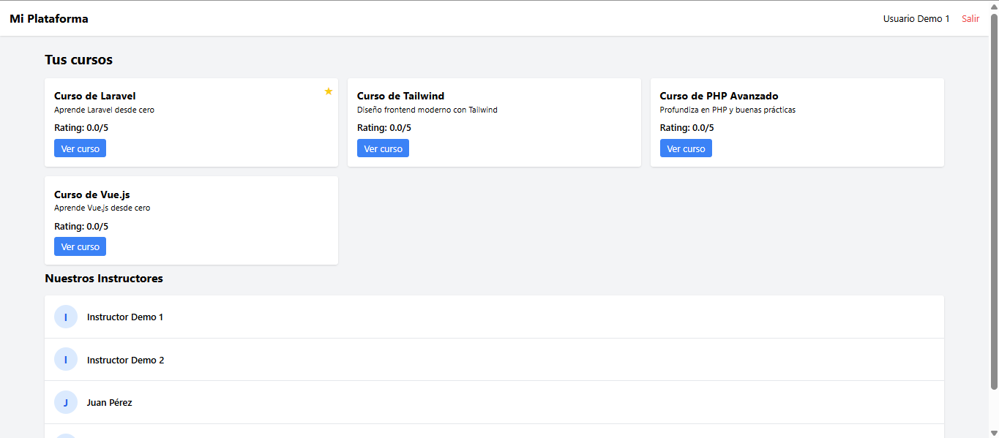
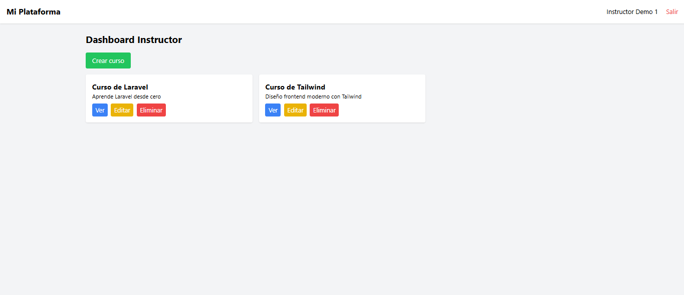
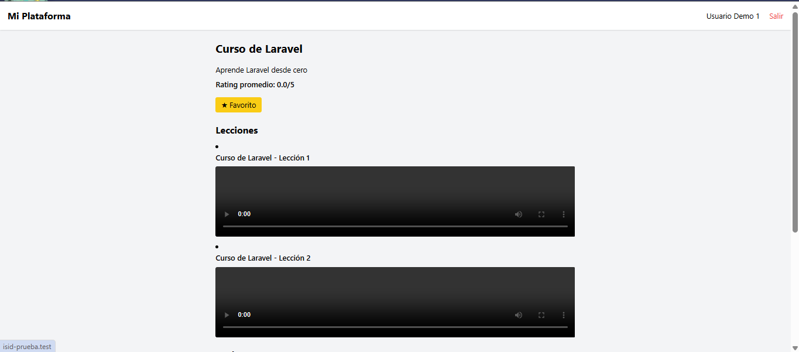
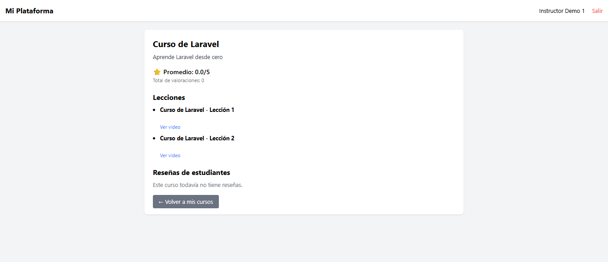
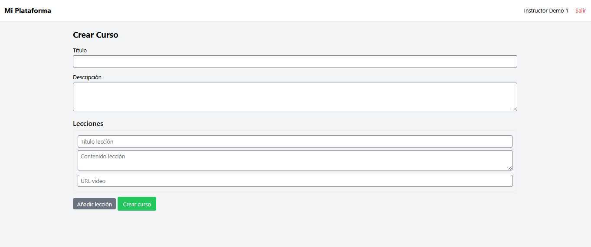
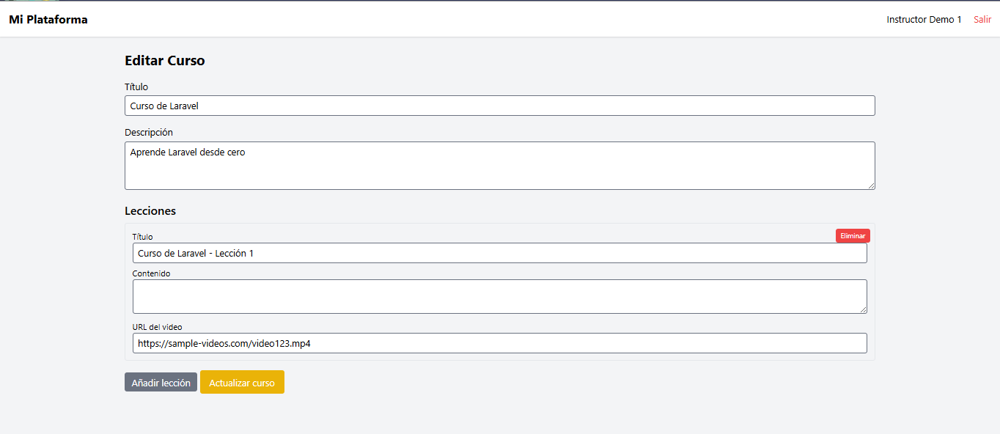

# Plataforma de Cursos - Prueba Técnica

Esta es una aplicación Laravel que simula una plataforma de cursos en línea, desarrollada como parte de una prueba técnica. Permite gestionar cursos, lecciones, instructores y usuarios, incluyendo funcionalidades como favoritos y reviews.

---

## Requisitos cubiertos

1. **Relaciones y modelos:**
   - `Instructor` (usuario con rol de instructor) tiene muchos `Course`.
   - `Course` pertenece a un `Instructor`.
   - `Course` tiene muchas `Lesson`.
   - `Lesson` tiene un video asociado.
   - `User` puede marcar cursos como favoritos.
   - `User` puede dejar comentarios y calificaciones (reviews).

2. **CRUD y validaciones para cursos:**
   - Los instructores pueden crear, leer, actualizar y eliminar sus cursos.
   - Cada curso puede tener múltiples lecciones, que se gestionan en el mismo formulario.
   - Validaciones aplicadas en todos los campos (`title`, `description`, `lessons`).

3. **Optimización:**
   - El listado de instructores se recupera de manera eficiente usando Eloquent (`select`, `with` y paginación si fuera necesario).
   - Servicio que calcula el **rating promedio de cada curso** implementado usando `withAvg('reviews', 'rating')`.

4. **Funcionalidades adicionales implementadas:**
   - Dashboard diferenciado para usuarios e instructores.
   - Middleware de permisos para asegurar que solo los instructores gestionen sus cursos y que los usuarios solo puedan interactuar con sus propios favoritos/reviews.
   - Usuarios pueden marcar cursos como favoritos y ver el estado en el dashboard.
   - Visualización de reviews y ratings en la página de detalle de curso.

## Instalación

1. **Clona el repositorio:**
git clone https://github.com/barbaraSantano/isid-prueba.git
cd isid-prueba

2. **Instala dependencias:**
composer install
npm install
npm run dev

3. **Configura el .env y genera la clave de aplicación:**
cp .env.example .env
php artisan key:

4. **Ejecuta migraciones y seeders de prueba:**
php artisan migrate --seed

Se crean cuatro usuarios de prueba:

    user1@test.com	Usuario (alumno)
    user2@test.com	Usuario (alumno)
    instructor1@test.com   Instructor
    instructor2@test.com   Instructor

**PWD: test12345

Los seeders también crean instructores adicionales y cursos de prueba.

5. **Inicia el servidor:**
php artisan serve

## Estructura del proyecto

- **app/Models**

    User, Instructor, Course, Lesson, Review, Favorite.

- **app/Http/Controllers**

    InstructorController → gestión de cursos y lecciones.

    UserController → gestión de favoritos y reviews.

    DashboardController → vistas de dashboards diferenciadas.

- **resources/views**

    layouts/ → plantillas base para usuarios e instructores.

    dashboard/ → dashboards

        * User:
            
        
        * Instructor:
            

    courses/user/ → vistas de cursos para usuarios

        * Show (user):
            

    courses/instructor/ → vistas de cursos para instructores

        * Show (instructor):
            

        * Create (instructor):
            

        * Edit (instructor):
            

- **routes/web.php**

    Rutas diferenciadas por roles (auth, instructor, owner.course).